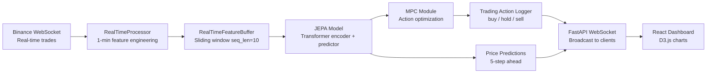

# 🪙 Crypto Microstructure JEPA — Project Analysis

## What Is This Project?

This is a **real-time cryptocurrency trading system** that combines:

1. **Market Microstructure Analysis** — Collects tick-level trade data via Binance WebSocket, aggregates it into 1-minute bars, and computes market microstructure features (order flow imbalance, scaled volatility, log returns, etc.)
2. **JEPA (Joint Embedding Predictive Architecture)** — A self-supervised Transformer-based model that learns representations of market state and predicts future price movements
3. **MPC (Model Predictive Control)** — Uses the JEPA model to simulate future market states and optimize trading actions (buy / hold / sell) by minimizing a cost function that balances transaction costs, risk, and expected returns
4. **Real-time Dashboard** — A FastAPI + WebSocket backend serves a React/D3.js frontend that shows live price charts, RSI indicator, trading actions, and model predictions

### Architecture Diagram



---

## Project Files

| File | Purpose |
|------|---------|
| [crypto_trading_pipeline.py](file:///Users/swastikshukla/Development/Crypto_Microstructure_JEPA/crypto_trading_pipeline.py) | Core pipeline: data collection, feature engineering, JEPA model, MPC, training |
| [main.py](file:///Users/swastikshukla/Development/Crypto_Microstructure_JEPA/main.py) | FastAPI server that serves the dashboard and WebSocket updates |
| [index.html](file:///Users/swastikshukla/Development/Crypto_Microstructure_JEPA/index.html) | React + D3.js real-time trading dashboard |
| [requirements.txt](file:///Users/swastikshukla/Development/Crypto_Microstructure_JEPA/requirements.txt) | Python dependencies |

---

## How to Run

### Step 1: Install Dependencies

```bash
cd /Users/swastikshukla/Development/Crypto_Microstructure_JEPA
pip install -r requirements.txt
```

### Step 2: Train the Model (first-time only)

The model needs to be trained before the dashboard can work. Run the pipeline script:

```bash
python crypto_trading_pipeline.py
```

This will:
- Prompt you for a ticker symbol (e.g., `BTCUSDT`)
- Fetch 90 days of 1-minute kline data from Binance
- Compute features and train the JEPA model for 50 epochs
- Save `jepa_model.pth` and `scaler.pkl`

> [!IMPORTANT]
> This requires internet access to reach the Binance API. No API key is needed for public kline data, but the `python-binance` Client is initialized without credentials, which works for public endpoints only.

### Step 3: Start the Dashboard

```bash
uvicorn main:app --reload --host 0.0.0.0 --port 8000
```

Then open http://localhost:8000 in your browser.

> [!WARNING]
> The dashboard requires `jepa_model.pth` and `scaler.pkl` to exist. If they don't, the server will log an error and the system won't initialize.

---

## 🐛 Issues & Bugs Found

### 1. `seq_len` Mismatch Between Training and Inference

| Context | `seq_len` |
|---------|-----------|
| Training (`crypto_trading_pipeline.py` L442) | **60** |
| CLI inference (`crypto_trading_pipeline.py` L461) | **60** |
| Dashboard inference (`main.py` L84) | **10** |

The model is trained on sequences of length 60, but the dashboard uses a buffer of 10. This means the model receives input with a completely different shape than what it was trained on, which will produce **garbage predictions**.

### 2. Feature Key Ordering is Fragile

In [RealTimeFeatureBuffer.add_feature()](file:///Users/swastikshukla/Development/Crypto_Microstructure_JEPA/crypto_trading_pipeline.py#L311), features are extracted using `sorted(feature_dict.keys())`. This relies on dictionary key names sorting alphabetically to match the model's expected input order. If any key name changes, the features will be silently misaligned.

### 3. MPC `optimize_action` Uses Only 50 Random Samples

The [MPCModule](file:///Users/swastikshukla/Development/Crypto_Microstructure_JEPA/crypto_trading_pipeline.py#L351-L360) evaluates only 50 random action sequences over a horizon of 30 steps. With `3^30 ≈ 2×10^14` possible sequences, this is an extremely sparse search.

### 4. No Position Tracking

The system recommends buy/sell/hold but never tracks the current position, PnL, portfolio value, or exposure. It can recommend "sell" when there's nothing to sell.

### 5. `@app.on_event` is Deprecated

FastAPI has deprecated `on_event` in favor of `lifespan` context managers.

### 6. Frontend Uses Outdated Tailwind CSS v2.2

The dashboard loads TailwindCSS 2.2.19, which is very outdated.

---

## 🚀 Improvement Recommendations

### Priority 1: Critical Fixes

| # | Improvement | Impact |
|---|------------|--------|
| 1 | **Fix `seq_len` mismatch** — Change `main.py` L84 to `seq_len = 60` | 🔴 Predictions are currently meaningless |
| 2 | **Use explicit feature ordering** — Replace `sorted(keys)` with a fixed list of column names | 🔴 Prevents silent feature misalignment |
| 3 | **Add position tracking** — Track holdings, entry price, PnL, and only allow sell when long | 🔴 Required for any meaningful trading logic |

### Priority 2: Model Improvements

| # | Improvement | Impact |
|---|------------|--------|
| 4 | **Add validation split** — Currently trains on all data with no validation; add train/val split and early stopping | 🟡 Prevent overfitting |
| 5 | **Add learning rate scheduler** — Use `CosineAnnealingLR` or `ReduceLROnPlateau` | 🟡 Better convergence |
| 6 | **Improve MPC search** — Use Cross-Entropy Method (CEM) or gradient-based planning instead of random sampling | 🟡 Much better action selection |
| 7 | **Add attention masking** — The Transformer encoder has no causal mask, so it can attend to future positions within the input window | 🟡 More realistic autoregressive prediction |
| 8 | **Add EMA target encoder** — True JEPA uses an exponential moving average target encoder; this implementation has no target encoder at all | 🟡 Better self-supervised learning |

### Priority 3: Trading Logic

| # | Improvement | Impact |
|---|------------|--------|
| 9 | **Risk management** — Add stop-loss, take-profit, max position size, max drawdown limits | 🟡 Essential for real trading |
| 10 | **Backtesting framework** — Add ability to replay historical data and compute Sharpe ratio, max drawdown, win rate | 🟡 Evaluate strategy before going live |
| 11 | **Slippage and fee modeling** — The cost model uses a flat 0.001 per trade; real exchanges have tiered fees and slippage | 🟢 More realistic cost estimation |
| 12 | **Multi-asset support** — Correlate signals across multiple crypto pairs | 🟢 Better alpha generation |

### Priority 4: Infrastructure & Frontend

| # | Improvement | Impact |
|---|------------|--------|
| 13 | **Add database persistence** — Store trades, predictions, and features in SQLite or PostgreSQL | 🟡 Data survives restarts |
| 14 | **Dockerize the project** — Add `Dockerfile` and `docker-compose.yml` | 🟢 Easy deployment |
| 15 | **Redesign the dashboard** — Dark theme, candlestick charts, MACD/Bollinger visualizations, PnL curve | 🟢 Premium look and more useful |
| 16 | **Add authentication** — The API currently has no auth and CORS allows all origins | 🟢 Security |
| 17 | **Upgrade to modern Tailwind + Vite** — Replace CDN React+Babel with a proper build system | 🟢 Better DX and performance |

---

## Summary

This is a well-structured prototype of an **AI-powered crypto trading system** that combines modern ML (JEPA + Transformer) with control theory (MPC). However, the **critical `seq_len` mismatch** means the dashboard predictions are currently broken. The core ML pipeline (data collection → feature engineering → training) works, but the trading logic lacks position management and risk controls.

> [!IMPORTANT]
> **What would you like to do next?** I can:
> 1. **Fix the critical bugs** (seq_len mismatch, feature ordering) and get the project running
> 2. **Add position tracking + backtesting** to make the trading logic meaningful
> 3. **Redesign the frontend** into a premium dark-themed dashboard
> 4. **All of the above** — I can create a full implementation plan
>
> Let me know your priority!
